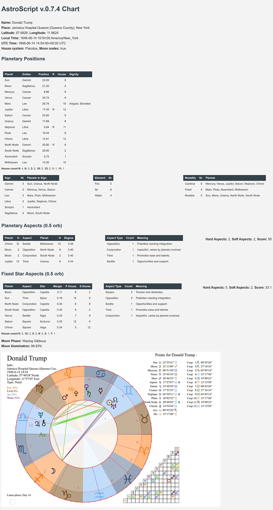
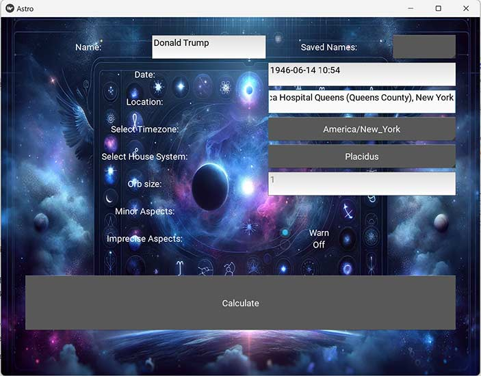

# AstroScript

AstroScript is a powerful astrology software tool designed to calculate and output astrological charts and data. It leverages the Swiss Ephemeris for precise planetary and house calculations, and Kerykeion for graphical charts, and offers extensive features including planet positions, house positions, aspect calculations, synastry, davision charts, and fixed star and asteroid aspects. It can also output html. 

## Features

- **Planetary Calculations**: Provides detailed longitude, zodiac sign, and retrograde information for all major and some minor celestial bodies.
- **House Calculations**: Supports multiple house systems, including Placidus, Koch, and others, for accurate astrological house placement.
- **Aspect Analysis**: Calculates major and minor astrological aspects between planets and fixed stars.
- **Moon Phase Calculation**: Determines the current phase of the Moon and its illumination.
- **Fixed Star Aspects**: Lists aspects between planets and fixed stars, considering the house placement of each fixed star.
- **Asteroid Aspects**: Lists aspects between planets and asteroids, considering the house placements.
- **Tropical or Sidereal Zodiac**: Use tropical positions by default, or Sidereal Lahiri positions with `--zodiac sidereal` or `--zodiac vedic`. The selected zodiac applies to planets, asteroids, fixed stars, angles, and house cusps.
- **Location Handling**: Uses Nominatim via the geopy library to convert location names to geographic coordinates, with the ability to save and retrieve frequently used locations.
- **Davison relationship charts**: Calculate Davison relationship charts for as many people as you like.
- **Customizable**: There are switches for showing degrees in minutes, minor aspects, brief aspects (for transits), different house calculations, the level of harmony/disharmony of different aspects (also taking into account the magnitude of stars and orb), etc.
- **GUI**: Optional rudimentary GUI for easier interaction w/o CLI.
- **Export as responsive HTML**: Use `--output html` and redirect to a file e.g `> chart.html`.



## File Structure

The project is organized as follows:

### Main Application Files
- **`astro_script.py`** - CLI entrypoint and compatibility facade
- **`src/astroscript/`** - Modularized astrology engine (constants, calculations, output, CLI)
- **`src/gui/`** - GUI assets and entrypoints (Kivy, KivyMD)
- **`src/charts/chart_output.py`** - Handles chart generation and output formatting
- **`src/db/db_manager.py`** - Database operations for storing events and locations
- **`src/version.py`** - Version information for the application

### Database and Location Management
- **`saved_locations.json`** - JSON file storing frequently used locations
- **`src/add_altitude_column.py`** - Database migration script for adding altitude data
- **`src/add-id-column-location.py`** - Script to add ID columns to location tables
- **`update_altitude.py`** - Updates altitude information in the database

### Testing and Utilities
- **`testfindhowlong.py`** - Test script for duration calculations
- **`requirements.txt`** - Python package dependencies
- **`README.md`** - Project documentation (this file)

### Resources and Assets
- **`AstroScript_background.webp`** - Background image for the GUI application

### Directories
- **`cache/`** - Contains cached data files
  - `kerykeion_geonames_cache.sqlite` - Cached geographic location data
- **`ephe/`** - Swiss Ephemeris files for astronomical calculations
  - `astlistn.md` - Asteroid list documentation
  - `astrologically_known_fixed_stars.csv/txt` - Fixed star data
  - `fixed_stars_all.csv/txt` - Complete fixed star catalog
  - `sabian.json` - Sabian symbols data
  - `seas_*.se1` - Swiss Ephemeris data files
  - `sefstars.txt` - Star positions file
- **`font/`** - Custom fonts for the GUI
  - `RobotoMono-Regular.ttf` - Monospaced font for clear text display
  - `LICENSE.txt` - Font license information
- **`img/`** - Documentation images
  - `GUI.jpg` - Screenshot of the GUI interface
  - `sample_html.jpg` - Example of HTML output

## Installation

1. **Clone the repository:**
   ```bash
   git clone https://github.com/Shoresh613/astro-script.git
   cd AstroScript
   ```

2. **Install dependencies:**
   ```bash
   pip install -r requirements.txt
   ```

3. **Set up the ephemeris:**
   - Download the necessary ephemeris files from [http://www.astro.com/swisseph/](http://www.astro.com/swisseph/)
   - Place them in the `./ephe/` directory.

## Usage

### Command Line Interface

You can run AstroScript with the following command (so far it only accepts date and time in the following format):

```bash
python astro_script.py --name "John Doe" --date "2021-12-25 15:30" --location "New York, USA" --timezone "America/New_York"
```

Sidereal and Vedic are aliases for the same Lahiri calculation mode:

```bash
python astro_script.py --date "2021-12-25 15:30" --zodiac sidereal --latitude 57.7 --longitude 11.9 --timezone Europe/Stockholm
python astro_script.py --date "2021-12-25 15:30" --zodiac vedic --latitude 57.7 --longitude 11.9 --timezone Europe/Stockholm
```

This option changes positional calculations only. It does not add nakshatras, dashas, Vedic aspects, or separate Vedic dignity rules.

Search for exact major aspects between the moving bodies in `PLANETS` during an
inclusive local-time period:

```bash
python astro_script.py --aspect-period "2026-07-01 00:00" "2026-07-08 00:00" --timezone Europe/Stockholm
```

Aspect-period searches are geocentric and tropical by default. Use `--zodiac`
to change zodiac mode. CLI output supports `text` and `return_text`; HTML is not
generated for period searches. A topocentric search requires explicit coordinates:

```bash
python astro_script.py --aspect-period "2026-07-01 00:00" "2026-07-02 00:00" --timezone Europe/Stockholm --center topocentric --latitude 57.7 --longitude 11.9
```

The reusable Python API returns structured, chronologically sorted events:

```python
from datetime import datetime, timezone

from astroscript.aspect_search import AspectSearchQuery, search_exact_aspects

events = search_exact_aspects(
    AspectSearchQuery(
        start=datetime(2026, 7, 1, tzinfo=timezone.utc),
        end=datetime(2026, 7, 8, tzinfo=timezone.utc),
    )
)
```

`bodies` and `aspect_types` can optionally be supplied on `AspectSearchQuery`.
The default excludes angles and house cusps and searches conjunctions,
oppositions, squares, trines, and sextiles.

### Opportunity windows

Opportunity searches combine required and optional astrological conditions. All
required conditions must overlap. Every condition contributes its configured
weight to a transparent `0-100` score based only on its distance from the exact
aspect or lunar phase.

Create a JSON rule file. A runnable version of this example is included at
`examples/opportunity_rules.json`:

```json
{
  "start": "2026-07-01 00:00",
  "end": "2026-08-01 00:00",
  "timezone": "Europe/Stockholm",
  "conditions": [
    {
      "id": "full_moon",
      "type": "moon_phase",
      "phase": "full",
      "max_deviation_degrees": 8,
      "required": true,
      "weight": 1
    },
    {
      "id": "venus_jupiter",
      "type": "aspect",
      "body1": "Venus",
      "body2": "Jupiter",
      "aspects": ["Trine"],
      "max_orb_degrees": 2,
      "required": false,
      "weight": 2
    }
  ]
}
```

Run the search with:

```bash
python astro_script.py --opportunity-search examples/opportunity_rules.json
```

Aspect conditions accept names from both `MAJOR_ASPECTS` and `MINOR_ASPECTS`.
Moon phase conditions accept `new`, `first_quarter`, `full`, and
`last_quarter`. Set `required` to `false` for a condition that should affect
ranking without restricting which windows qualify. The Python API is available
from `astroscript.opportunity_search` through `OpportunitySearchQuery`,
`AspectCondition`, `MoonPhaseCondition`, and `search_opportunities()`.

Natal transit searches add an inline `natal_chart` to the same rule file. Use a
`natal_aspect` condition for aspects from a moving body to a fixed natal planet,
angle (`Ascendant`, `Midheaven`, `IC`, or `DC`), or house cusp (`House 1` through
`House 12`). Use `transit_natal_house` to require a moving body to occupy one or
more natal houses:

```bash
python astro_script.py --opportunity-search examples/natal_opportunity_rules.json
```

The Python API exposes these as `NatalChart`, `NatalAspectCondition`, and
`TransitNatalHouseCondition`. A natal chart with `time_unknown: true` uses local
noon for planetary positions and rejects house-, cusp-, and angle-dependent
conditions because those cannot be calculated reliably without a birth time.

Asteroid bodies are opt-in and use the same aspect and natal condition types as
planets. Supported names are `Ceres`, `Pholus`, `Pallas`, `Juno`, and `Vesta`.
They can be selected through `AspectSearchQuery.bodies`, used on either side of
an `AspectCondition`, used as a moving or natal target in
`NatalAspectCondition`, and placed in natal houses with
`TransitNatalHouseCondition`. They are deliberately excluded from default
searches to keep result volume manageable.

```bash
python astro_script.py --opportunity-search examples/asteroid_opportunity_rules.json
```

Fixed stars are also opt-in. The curated set is `Aldebaran`, `Algol`,
`Antares`, `Regulus`, `Sirius`, `Spica`, `Polaris`, `Arcturus`, `Deneb`,
`Rigel`, `Capella`, `Altair`, and `Vega`. A curated star can be selected in
`AspectSearchQuery.bodies`, used on either side of an `AspectCondition`, or
used as a moving or natal target in `NatalAspectCondition`. Conditions involving
a fixed star have a maximum orb of `1°`. Fixed stars are not included in default
aspect searches, and the complete star catalog is deliberately unavailable to
the search API so that searches remain focused and bounded.

```bash
python astro_script.py --opportunity-search examples/fixed_star_opportunity_rules.json
```

Electional conditions can be combined with aspects, moon phases, natal
conditions, asteroids, and fixed stars in the same rule file:

- `retrograde`: require a body to be retrograde or direct with `"retrograde":
  true` or `false`.
- `zodiac_sign`: require `body` to be in one of `signs`.
- `transit_house`: require `body` to be in one of the current chart `houses`.
  This is distinct from `transit_natal_house`.
- `void_of_course_moon`: require or avoid VOC with `"void": true` or `false`.
- `planetary_hour`: require one of the traditional seven `rulers`.

`transit_house` and `planetary_hour` require top-level `latitude` and
`longitude`; current houses use the top-level `house_system`, which defaults to
Placidus. Planetary hours use the twelve unequal daylight hours from sunrise to
sunset and the twelve unequal night hours from sunset to the following sunrise,
in the rule file's timezone.

Void of Course Moon uses the traditional definition implemented here: the
period begins after the Moon's last exact conjunction, sextile, square, trine,
or opposition to the Sun, Mercury, Venus, Mars, Jupiter, or Saturn before the
Moon enters its next zodiac sign. The VOC period ends at that sign ingress.

```bash
python astro_script.py --opportunity-search examples/electional_opportunity_rules.json
```

The Python API exposes these rules as `RetrogradeCondition`,
`ZodiacSignCondition`, `TransitHouseCondition`,
`VoidOfCourseMoonCondition`, and `PlanetaryHourCondition`.

### Activity presets

Bundled presets provide separate, transparent rule sets for
`general_election`, `communication_and_contracts`,
`relationships_and_social`, `creative_work`, and `launch_and_business`.
Reference one or more names through the top-level `presets` array; an optional
`conditions` array adds custom rules without changing the preset:

```json
{
  "start": "2026-08-01 00:00",
  "end": "2026-08-08 00:00",
  "timezone": "Europe/Stockholm",
  "latitude": 57.7089,
  "longitude": 11.9746,
  "presets": ["relationships_and_social"]
}
```

```bash
python astro_script.py --list-opportunity-presets
python astro_script.py --opportunity-search examples/preset_opportunity_rules.json
```

The complete rules, weights, required conditions, rationale, and location
requirements are documented in
[`docs/opportunity_presets.md`](docs/opportunity_presets.md). Presets are
starting points rather than guarantees; copy or supplement their JSON rules to
change their assumptions.


### Options

- `--name`: Name of the person or event.
- `--date`: Date and time of the event in local time (format: YYYY-MM-DD HH:MM:SS).
- `--location`: Location name for looking up geographic coordinates.
- `--latitude` and `--longitude`: Specific latitude and longitude to use.
- `--timezone`: Timezone of the location.
- `--aspect-period`: Inclusive start and end for an exact moving-body aspect search (`YYYY-MM-DD HH:MM`).
- `--opportunity-search`: Read combined aspect and moon-phase conditions from a JSON rule file.
- `--list-opportunity-presets`: List bundled activity presets and location requirements.
- `--house_system`: House system to use, defaults to Placidus.
- `--zodiac`: Zodiac mode (`tropical`, `sidereal`, or `vedic`). `sidereal` and `vedic` both use Lahiri ayanamsha; the default is `tropical`.
- `--output_type`: Format of the output (`text`, `return_text`, `html`).
- `--save_settings`: Save the specified settings. If no parameter passed, will save "default" settings, that will be used henceforth.
- `--use_saved_settings`: Loads the specified settings. If no parameter passed, will use "default" settings (will use default settings if saved even if `--use_saved_settings` not passed).

For a complete list of options, call:

```bash
python astro_script.py -h
```

### GUI Integration

AstroScript includes a graphical user interface developed with the Kivy framework, offering a more interactive way to input data and display astrological calculations. Here's a brief overview of the GUI functionalities:

1. **Interactive Forms**: Users can input data through text fields, dropdowns, and date/time pickers.
2. **Responsive Layout**: The GUI adapts to different device screen sizes, making it usable on both desktop and mobile platforms.
3. **Real-Time Results Display**: Calculations are shown immediately on the screen, with options to navigate between input and results screens easily. The results can be copied to clipboard.
4. **Customizable Options**: Users can choose different astrological options such as house systems, aspects types, and whether to include minor aspects.

#### Running the GUI

To launch the GUI, run the following command:

```bash
python src/gui/main.py
```

This starts the application, where you can navigate through the input screen to enter event details and view calculated results in real-time.


*Image of GUI running on Windows, but it can also run on for example Android*

### Available timezones
<details>
  <summary>Timezones are handled by pytz, click here to see the list of all available timezones.</summary>

Africa/Abidjan, Africa/Accra, Africa/Addis_Ababa, Africa/Algiers, Africa/Asmara, Africa/Asmera, Africa/Bamako, Africa/Bangui, Africa/Banjul, Africa/Bissau, Africa/Blantyre, Africa/Brazzaville, Africa/Bujumbura, Africa/Cairo, Africa/Casablanca, Africa/Ceuta, Africa/Conakry, Africa/Dakar, Africa/Dar_es_Salaam, Africa/Djibouti, Africa/Douala, Africa/El_Aaiun, Africa/Freetown, Africa/Gaborone, Africa/Harare, Africa/Johannesburg, Africa/Juba, Africa/Kampala, Africa/Khartoum, Africa/Kigali, Africa/Kinshasa, Africa/Lagos, Africa/Libreville, Africa/Lome, Africa/Luanda, Africa/Lubumbashi, Africa/Lusaka, Africa/Malabo, Africa/Maputo, Africa/Maseru, Africa/Mbabane, Africa/Mogadishu, Africa/Monrovia, Africa/Nairobi, Africa/Ndjamena, Africa/Niamey, Africa/Nouakchott, Africa/Ouagadougou, Africa/Porto-Novo, Africa/Sao_Tome, Africa/Timbuktu, Africa/Tripoli, Africa/Tunis, Africa/Windhoek, America/Adak, America/Anchorage, America/Anguilla, America/Antigua, America/Araguaina, America/Argentina/Buenos_Aires, America/Argentina/Catamarca, America/Argentina/ComodRivadavia, America/Argentina/Cordoba, America/Argentina/Jujuy, America/Argentina/La_Rioja, America/Argentina/Mendoza, America/Argentina/Rio_Gallegos, America/Argentina/Salta, America/Argentina/San_Juan, America/Argentina/San_Luis, America/Argentina/Tucuman, America/Argentina/Ushuaia, America/Aruba, America/Asuncion, America/Atikokan, America/Atka, America/Bahia, America/Bahia_Banderas, America/Barbados, America/Belem, America/Belize, America/Blanc-Sablon, America/Boa_Vista, America/Bogota, America/Boise, America/Buenos_Aires, America/Cambridge_Bay, America/Campo_Grande, America/Cancun, America/Caracas, America/Catamarca, America/Cayenne, America/Cayman, America/Chicago, America/Chihuahua, America/Ciudad_Juarez, America/Coral_Harbour, America/Cordoba, America/Costa_Rica, America/Creston, America/Cuiaba, America/Curacao, America/Danmarkshavn, America/Dawson, America/Dawson_Creek, America/Denver, America/Detroit, America/Dominica, America/Edmonton, America/Eirunepe, America/El_Salvador, America/Ensenada, America/Fort_Nelson, America/Fort_Wayne, America/Fortaleza, America/Glace_Bay, America/Godthab, America/Goose_Bay, America/Grand_Turk, America/Grenada, America/Guadeloupe, America/Guatemala, America/Guayaquil, America/Guyana, America/Halifax, America/Havana, America/Hermosillo, America/Indiana/Indianapolis, America/Indiana/Knox, America/Indiana/Marengo, America/Indiana/Petersburg, America/Indiana/Tell_City, America/Indiana/Vevay, America/Indiana/Vincennes, America/Indiana/Winamac, America/Indianapolis, America/Inuvik, America/Iqaluit, America/Jamaica, America/Jujuy, America/Juneau, America/Kentucky/Louisville, America/Kentucky/Monticello, America/Knox_IN, America/Kralendijk, America/La_Paz, America/Lima, America/Los_Angeles, America/Louisville, America/Lower_Princes, America/Maceio, America/Managua, America/Manaus, America/Marigot, America/Martinique, America/Matamoros, America/Mazatlan, America/Mendoza, America/Menominee, America/Merida, America/Metlakatla, America/Mexico_City, America/Miquelon, America/Moncton, America/Monterrey, America/Montevideo, America/Montreal, America/Montserrat, America/Nassau, America/New_York, America/Nipigon, America/Nome, America/Noronha, America/North_Dakota/Beulah, America/North_Dakota/Center, America/North_Dakota/New_Salem, America/Nuuk, America/Ojinaga, America/Panama, America/Pangnirtung, America/Paramaribo, America/Phoenix, America/Port-au-Prince, America/Port_of_Spain, America/Porto_Acre, America/Porto_Velho, America/Puerto_Rico, America/Punta_Arenas, America/Rainy_River, America/Rankin_Inlet, America/Recife, America/Regina, America/Resolute, America/Rio_Branco, America/Rosario, America/Santa_Isabel, America/Santarem, America/Santiago, America/Santo_Domingo, America/Sao_Paulo, America/Scoresbysund, America/Shiprock, America/Sitka, America/St_Barthelemy, America/St_Johns, America/St_Kitts, America/St_Lucia, America/St_Thomas, America/St_Vincent, America/Swift_Current, America/Tegucigalpa, America/Thule, America/Thunder_Bay, America/Tijuana, America/Toronto, America/Tortola, America/Vancouver, America/Virgin, America/Whitehorse, America/Winnipeg, America/Yakutat, America/Yellowknife, Antarctica/Casey, Antarctica/Davis, Antarctica/DumontDUrville, Antarctica/Macquarie, Antarctica/Mawson, Antarctica/McMurdo, Antarctica/Palmer, Antarctica/Rothera, Antarctica/South_Pole, Antarctica/Syowa, Antarctica/Troll, Antarctica/Vostok, Arctic/Longyearbyen, Asia/Aden, Asia/Almaty, Asia/Amman, Asia/Anadyr, Asia/Aqtau, Asia/Aqtobe, Asia/Ashgabat, Asia/Ashkhabad, Asia/Atyrau, Asia/Baghdad, Asia/Bahrain, Asia/Baku, Asia/Bangkok, Asia/Barnaul, Asia/Beirut, Asia/Bishkek, Asia/Brunei, Asia/Calcutta, Asia/Chita, Asia/Choibalsan, Asia/Chongqing, Asia/Chungking, Asia/Colombo, Asia/Dacca, Asia/Damascus, Asia/Dhaka, Asia/Dili, Asia/Dubai, Asia/Dushanbe, Asia/Famagusta, Asia/Gaza, Asia/Harbin, Asia/Hebron, Asia/Ho_Chi_Minh, Asia/Hong_Kong, Asia/Hovd, Asia/Irkutsk, Asia/Istanbul, Asia/Jakarta, Asia/Jayapura, Asia/Jerusalem, Asia/Kabul, Asia/Kamchatka, Asia/Karachi, Asia/Kashgar, Asia/Kathmandu, Asia/Katmandu, Asia/Khandyga, Asia/Kolkata, Asia/Krasnoyarsk, Asia/Kuala_Lumpur, Asia/Kuching, Asia/Kuwait, Asia/Macao, Asia/Macau, Asia/Magadan, Asia/Makassar, Asia/Manila, Asia/Muscat, Asia/Nicosia, Asia/Novokuznetsk, Asia/Novosibirsk, Asia/Omsk, Asia/Oral, Asia/Phnom_Penh, Asia/Pontianak, Asia/Pyongyang, Asia/Qatar, Asia/Qostanay, Asia/Qyzylorda, Asia/Rangoon, Asia/Riyadh, Asia/Saigon, Asia/Sakhalin, Asia/Samarkand, Asia/Seoul, Asia/Shanghai, Asia/Singapore, Asia/Srednekolymsk, Asia/Taipei, Asia/Tashkent, Asia/Tbilisi, Asia/Tehran, Asia/Tel_Aviv, Asia/Thimbu, Asia/Thimphu, Asia/Tokyo, Asia/Tomsk, Asia/Ujung_Pandang, Asia/Ulaanbaatar, Asia/Ulan_Bator, Asia/Urumqi, Asia/Ust-Nera, Asia/Vientiane, Asia/Vladivostok, Asia/Yakutsk, Asia/Yangon, Asia/Yekaterinburg, Asia/Yerevan, Atlantic/Azores, Atlantic/Bermuda, Atlantic/Canary, Atlantic/Cape_Verde, Atlantic/Faeroe, Atlantic/Faroe, Atlantic/Jan_Mayen, Atlantic/Madeira, Atlantic/Reykjavik, Atlantic/South_Georgia, Atlantic/St_Helena, Atlantic/Stanley, Australia/ACT, Australia/Adelaide, Australia/Brisbane, Australia/Broken_Hill, Australia/Canberra, Australia/Currie, Australia/Darwin, Australia/Eucla, Australia/Hobart, Australia/LHI, Australia/Lindeman, Australia/Lord_Howe, Australia/Melbourne, Australia/NSW, Australia/North, Australia/Perth, Australia/Queensland, Australia/South, Australia/Sydney, Australia/Tasmania, Australia/Victoria, Australia/West, Australia/Yancowinna, Brazil/Acre, Brazil/DeNoronha, brazil/East, Brazil/West, CET, CST6CDT, Canada/Atlantic, Canada/Central, Canada/Eastern, Canada/Mountain, Canada/Newfoundland, Canada/Pacific, Canada/Saskatchewan, Canada/Yukon, Chile/Continental, Chile/EasterIsland, Cuba, EET, EST, EST5EDT, Egypt, Eire, Etc/GMT, Etc/GMT+0, Etc/GMT+1, Etc/GMT+10, Etc/GMT+11, Etc/GMT+12, Etc/GMT+2, Etc/GMT+3, Etc/GMT+4, Etc/GMT+5, Etc/GMT+6, Etc/GMT+7, Etc/GMT+8, Etc/GMT+9, Etc/GMT-0, Etc/GMT-1, Etc/GMT-10, Etc/GMT-11, Etc/GMT-12, Etc/GMT-13, Etc/GMT-14, Etc/GMT-2, Etc/GMT-3, Etc/GMT-4, Etc/GMT-5, Etc/GMT-6, Etc/GMT-7, Etc/GMT-8, Etc/GMT-9, Etc/GMT0, Etc/Greenwich, Etc/UCT, Etc/UTC, Etc/Universal, Etc/Zulu, Europe/Amsterdam, Europe/Andorra, Europe/Astrakhan, Europe/Athens, Europe/Belfast, Europe/Belgrade, Europe/Berlin, Europe/Bratislava, Europe/Brussels, Europe/Bucharest, Europe/Budapest, Europe/Busingen, Europe/Chisinau, Europe/Copenhagen, Europe/Dublin, Europe/Gibraltar, Europe/Guernsey, Europe/Helsinki, Europe/Isle_of_Man, Europe/Istanbul, Europe/Jersey, Europe/Kaliningrad, Europe/Kiev, Europe/Kirov, Europe/Kyiv, Europe/Lisbon, Europe/Ljubljana, Europe/London, Europe/Luxembourg, Europe/Madrid, Europe/Malta, Europe/Mariehamn, Europe/Minsk, Europe/Monaco, Europe/Moscow, Europe/Nicosia, Europe/Oslo, Europe/Paris, Europe/Podgorica, Europe/Prague, Europe/Riga, Europe/Rome, Europe/Samara, Europe/San_Marino, Europe/Sarajevo, Europe/Saratov, Europe/Simferopol, Europe/Skopje, Europe/Sofia, Europe/Stockholm, Europe/Tallinn, Europe/Tirane, Europe/Tiraspol, Europe/Ulyanovsk, Europe/Uzhgorod, Europe/Vaduz, Europe/Vatican, Europe/Vienna, Europe/Vilnius, Europe/Volgograd, Europe/Warsaw, Europe/Zagreb, Europe/Zaporozhye, Europe/Zurich, GB, GB-Eire, GMT, GMT+0, GMT-0, GMT0, Greenwich, HST, Hongkong, Iceland, Indian/Antananarivo, Indian/Chagos, Indian/Christmas, Indian/Cocos, Indian/Comoro, Indian/Kerguelen, Indian/Mahe, Indian/Maldives, Indian/Mauritius, Indian/Mayotte, Indian/Reunion, Iran, Israel, Jamaica, Japan, Kwajalein, Libya, MET, MST, MST7MDT, Mexico/BajaNorte, Mexico/BajaSur, Mexico/General, NZ, NZ-CHAT, Navajo, PRC, PST8PDT, Pacific/Apia, Pacific/Auckland, Pacific/Bougainville, Pacific/Chatham, Pacific/Chuuk, Pacific/Easter, Pacific/Efate, Pacific/Enderbury, Pacific/Fakaofo, Pacific/Fiji, Pacific/Funafuti, Pacific/Galapagos, Pacific/Gambier, Pacific/Guadalcanal, Pacific/Guam, Pacific/Honolulu, Pacific/Johnston, Pacific/Kanton, Pacific/Kiritimati, Pacific/Kosrae, Pacific/Kwajalein, Pacific/Majuro, Pacific/Marquesas, Pacific/Midway, Pacific/Nauru, Pacific/Niue, Pacific/Norfolk, Pacific/Noumea, Pacific/Pago_Pago, Pacific/Palau, Pacific/Pitcairn, Pacific/Pohnpei, Pacific/Ponape, Pacific/Port_Moresby, Pacific/Rarotonga, Pacific/Saipan, Pacific/Samoa, Pacific/Tahiti, Pacific/Tarawa, Pacific/Tongatapu, Pacific/Truk, Pacific/Wake, Pacific/Wallis, Pacific/Yap, Poland, Portugal, ROC, ROK, Singapore, Turkey, UCT, US/Alaska, US/Aleutian, US/Arizona, US/Central, US/East-Indiana, US/Eastern, US/Hawaii, US/Indiana-Starke, US/Michigan, US/Mountain, US/Pacific, US/Samoa, UTC, Universal, W-SU, WET, Zulu
</details>

## Limitations
- The position of Chiron in Dates before the 3rd of January in the year 675 cannot be calculated.
- Dates before the 1st of January in the year 1 CE are not supported.
- Ephemeris files up until the year 3003 are included. For further dates, download more ephemeris files for Swiss Ephemeris and copy to the `ephe` directory.

## File Management

AstroScript interacts with various files to store and retrieve data, enhancing functionality and user experience.

### Ephemeris Files

- **Location**: `./ephe/`
- **Purpose**: Store astronomical data needed for precise planetary calculations.
- **Setup**: Users must download these files from external sources (e.g., [http://www.astro.com/swisseph/](http://www.astro.com/swisseph/)) and place them in the designated directory.

### Events and Locations File

- **Filename**: `db.sqlite3`
- **Purpose**: Stores details of astrological events, such as dates, times, and locations, for quick retrieval. Locations are also stored so as to avoid retrieving the same coordinates from the internet each time.
- **Usage**: Users can save event details for future reference, which facilitates repeated analyses without re-entering data. This is done automatically whenever a name is given as an argument.

## Font Management

AstroScript's GUI utilizes custom fonts to enhance the readability of the results. Here are details on the font used:

### Roboto Mono

- **Font Family**: Roboto Mono
- **Usage**: This monospaced font is used when showing the results in the GUI, ensuring clear and consistent readability.
- **Location**: Fonts are stored under the `fonts/` directory.
- **Setup**: The Roboto Mono font files are included with the application (see licence information). Users do not need to install or manage these fonts separately.

## To do
I'm working on getting Buildozer package it as an Android package for installing as an app. That's a big thing. Then there are other things.

## Contributing

Contributions to AstroScript are welcome! Please open issues for any bugs or new feature requests, and/or submit pull requests with your enhancements.

## License

This project is licensed under the MIT License - see the LICENSE.md file for details.
