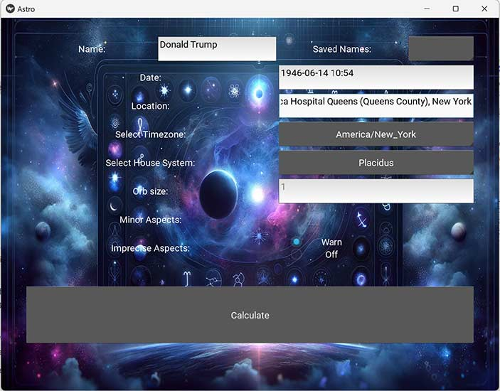

# AstroScript

AstroScript is a powerful astrology software tool designed to calculate and interpret astrological charts. It leverages the Swiss Ephemeris for precise planetary and house calculations, and offers extensive features including planet positions, house positions, aspect calculations, and fixed star conjunctions.

## Features

- **Planetary Calculations**: Provides detailed longitude, zodiac sign, and retrograde information for all major and some minor celestial bodies.
- **House Calculations**: Supports multiple house systems, including Placidus, Koch, and others, for accurate astrological house placement.
- **Aspect Analysis**: Calculates major and minor astrological aspects between planets and fixed stars.
- **Moon Phase Calculation**: Determines the current phase of the Moon and its illumination.
- **Fixed Star Aspects**: Lists aspects between planets and fixed stars, considering the house placement of each fixed star.
- **Asteroid Aspects**: Lists aspects between planets and asteroids, considering the house placements.
- **Location Handling**: Uses Nominatim via the geopy library to convert location names to geographic coordinates, with the ability to save and retrieve frequently used locations.
- **Davison relationship charts**: Calculate Davison relationship charts for as many people as you like.
- **Customizable**: There are switches for showing degrees in minutes, minor aspects, brief aspects (for transits), different house calculations, the level of harmony/disharmony of different aspects (also taking into account the magnitude of stars and orb), etc.
- **GUI**: Optional rudimentary GUI for easier interaction w/o CLI.
- **Export as responsive HTML**: Use `--output html` and redirect to a file e.g `> chart.html`.


## Installation

1. **Clone the repository:**
   ```bash
   git clone https://github.com/Shoresh613/astro-script.git
   cd AstroScript
   ```

2. **Install dependencies:**
   ```bash
   pip install -r requirements.txt
   ```

3. **Set up the ephemeris:**
   - Download the necessary ephemeris files from [http://www.astro.com/swisseph/](http://www.astro.com/swisseph/)
   - Place them in the `./ephe/` directory.

## Usage

### Command Line Interface

You can run AstroScript with the following command:

```bash
python astroscript.py --name "John Doe" --date "2021-12-25 15:30" --location "New York, USA"
```


### Options

- `--name`: Name of the person or event.
- `--date`: Date and time of the event in local time (format: YYYY-MM-DD HH:MM:SS).
- `--location`: Location name for looking up geographic coordinates.
- `--latitude` and `--longitude`: Specific latitude and longitude to use.
- `--timezone`: Timezone of the location.
- `--house_system`: House system to use, defaults to Placidus.
- `--output_type`: Format of the output (`text`, `return_text`, `html`).
- `--save_settings`: Save the specified settings. If no parameter passed, will save "default" settings, that will be used henceforth.
- `--use_saved_settings`: Loads the specified settings. If no parameter passed, will use "default" settings (will use default settings if saved even if `--use_saved_settings` not passed).

For a complete list of options, call:

```bash
python astroscript.py -h
```

### GUI Integration

AstroScript includes a graphical user interface developed with the Kivy framework, offering a more interactive way to input data and display astrological calculations. Here's a brief overview of the GUI functionalities:

1. **Interactive Forms**: Users can input data through text fields, dropdowns, and date/time pickers.
2. **Responsive Layout**: The GUI adapts to different device screen sizes, making it usable on both desktop and mobile platforms.
3. **Real-Time Results Display**: Calculations are shown immediately on the screen, with options to navigate between input and results screens easily. The results can be copied to clipboard.
4. **Customizable Options**: Users can choose different astrological options such as house systems, aspects types, and whether to include minor aspects.

#### Running the GUI

To launch the GUI, run the following command:

```bash
python main.py
```

This starts the application, where you can navigate through the input screen to enter event details and view calculated results in real-time.


*Image of GUI running on Windows, but it can also run on for example Android*

### Available timezones
<details>
  <summary>Timezones are handled by pytz, click here to see the list of all available timezones.</summary>

Africa/Abidjan, Africa/Accra, Africa/Addis_Ababa, Africa/Algiers, Africa/Asmara, Africa/Asmera, Africa/Bamako, Africa/Bangui, Africa/Banjul, Africa/Bissau, Africa/Blantyre, Africa/Brazzaville, Africa/Bujumbura, Africa/Cairo, Africa/Casablanca, Africa/Ceuta, Africa/Conakry, Africa/Dakar, Africa/Dar_es_Salaam, Africa/Djibouti, Africa/Douala, Africa/El_Aaiun, Africa/Freetown, Africa/Gaborone, Africa/Harare, Africa/Johannesburg, Africa/Juba, Africa/Kampala, Africa/Khartoum, Africa/Kigali, Africa/Kinshasa, Africa/Lagos, Africa/Libreville, Africa/Lome, Africa/Luanda, Africa/Lubumbashi, Africa/Lusaka, Africa/Malabo, Africa/Maputo, Africa/Maseru, Africa/Mbabane, Africa/Mogadishu, Africa/Monrovia, Africa/Nairobi, Africa/Ndjamena, Africa/Niamey, Africa/Nouakchott, Africa/Ouagadougou, Africa/Porto-Novo, Africa/Sao_Tome, Africa/Timbuktu, Africa/Tripoli, Africa/Tunis, Africa/Windhoek, America/Adak, America/Anchorage, America/Anguilla, America/Antigua, America/Araguaina, America/Argentina/Buenos_Aires, America/Argentina/Catamarca, America/Argentina/ComodRivadavia, America/Argentina/Cordoba, America/Argentina/Jujuy, America/Argentina/La_Rioja, America/Argentina/Mendoza, America/Argentina/Rio_Gallegos, America/Argentina/Salta, America/Argentina/San_Juan, America/Argentina/San_Luis, America/Argentina/Tucuman, America/Argentina/Ushuaia, America/Aruba, America/Asuncion, America/Atikokan, America/Atka, America/Bahia, America/Bahia_Banderas, America/Barbados, America/Belem, America/Belize, America/Blanc-Sablon, America/Boa_Vista, America/Bogota, America/Boise, America/Buenos_Aires, America/Cambridge_Bay, America/Campo_Grande, America/Cancun, America/Caracas, America/Catamarca, America/Cayenne, America/Cayman, America/Chicago, America/Chihuahua, America/Ciudad_Juarez, America/Coral_Harbour, America/Cordoba, America/Costa_Rica, America/Creston, America/Cuiaba, America/Curacao, America/Danmarkshavn, America/Dawson, America/Dawson_Creek, America/Denver, America/Detroit, America/Dominica, America/Edmonton, America/Eirunepe, America/El_Salvador, America/Ensenada, America/Fort_Nelson, America/Fort_Wayne, America/Fortaleza, America/Glace_Bay, America/Godthab, America/Goose_Bay, America/Grand_Turk, America/Grenada, America/Guadeloupe, America/Guatemala, America/Guayaquil, America/Guyana, America/Halifax, America/Havana, America/Hermosillo, America/Indiana/Indianapolis, America/Indiana/Knox, America/Indiana/Marengo, America/Indiana/Petersburg, America/Indiana/Tell_City, America/Indiana/Vevay, America/Indiana/Vincennes, America/Indiana/Winamac, America/Indianapolis, America/Inuvik, America/Iqaluit, America/Jamaica, America/Jujuy, America/Juneau, America/Kentucky/Louisville, America/Kentucky/Monticello, America/Knox_IN, America/Kralendijk, America/La_Paz, America/Lima, America/Los_Angeles, America/Louisville, America/Lower_Princes, America/Maceio, America/Managua, America/Manaus, America/Marigot, America/Martinique, America/Matamoros, America/Mazatlan, America/Mendoza, America/Menominee, America/Merida, America/Metlakatla, America/Mexico_City, America/Miquelon, America/Moncton, America/Monterrey, America/Montevideo, America/Montreal, America/Montserrat, America/Nassau, America/New_York, America/Nipigon, America/Nome, America/Noronha, America/North_Dakota/Beulah, America/North_Dakota/Center, America/North_Dakota/New_Salem, America/Nuuk, America/Ojinaga, America/Panama, America/Pangnirtung, America/Paramaribo, America/Phoenix, America/Port-au-Prince, America/Port_of_Spain, America/Porto_Acre, America/Porto_Velho, America/Puerto_Rico, America/Punta_Arenas, America/Rainy_River, America/Rankin_Inlet, America/Recife, America/Regina, America/Resolute, America/Rio_Branco, America/Rosario, America/Santa_Isabel, America/Santarem, America/Santiago, America/Santo_Domingo, America/Sao_Paulo, America/Scoresbysund, America/Shiprock, America/Sitka, America/St_Barthelemy, America/St_Johns, America/St_Kitts, America/St_Lucia, America/St_Thomas, America/St_Vincent, America/Swift_Current, America/Tegucigalpa, America/Thule, America/Thunder_Bay, America/Tijuana, America/Toronto, America/Tortola, America/Vancouver, America/Virgin, America/Whitehorse, America/Winnipeg, America/Yakutat, America/Yellowknife, Antarctica/Casey, Antarctica/Davis, Antarctica/DumontDUrville, Antarctica/Macquarie, Antarctica/Mawson, Antarctica/McMurdo, Antarctica/Palmer, Antarctica/Rothera, Antarctica/South_Pole, Antarctica/Syowa, Antarctica/Troll, Antarctica/Vostok, Arctic/Longyearbyen, Asia/Aden, Asia/Almaty, Asia/Amman, Asia/Anadyr, Asia/Aqtau, Asia/Aqtobe, Asia/Ashgabat, Asia/Ashkhabad, Asia/Atyrau, Asia/Baghdad, Asia/Bahrain, Asia/Baku, Asia/Bangkok, Asia/Barnaul, Asia/Beirut, Asia/Bishkek, Asia/Brunei, Asia/Calcutta, Asia/Chita, Asia/Choibalsan, Asia/Chongqing, Asia/Chungking, Asia/Colombo, Asia/Dacca, Asia/Damascus, Asia/Dhaka, Asia/Dili, Asia/Dubai, Asia/Dushanbe, Asia/Famagusta, Asia/Gaza, Asia/Harbin, Asia/Hebron, Asia/Ho_Chi_Minh, Asia/Hong_Kong, Asia/Hovd, Asia/Irkutsk, Asia/Istanbul, Asia/Jakarta, Asia/Jayapura, Asia/Jerusalem, Asia/Kabul, Asia/Kamchatka, Asia/Karachi, Asia/Kashgar, Asia/Kathmandu, Asia/Katmandu, Asia/Khandyga, Asia/Kolkata, Asia/Krasnoyarsk, Asia/Kuala_Lumpur, Asia/Kuching, Asia/Kuwait, Asia/Macao, Asia/Macau, Asia/Magadan, Asia/Makassar, Asia/Manila, Asia/Muscat, Asia/Nicosia, Asia/Novokuznetsk, Asia/Novosibirsk, Asia/Omsk, Asia/Oral, Asia/Phnom_Penh, Asia/Pontianak, Asia/Pyongyang, Asia/Qatar, Asia/Qostanay, Asia/Qyzylorda, Asia/Rangoon, Asia/Riyadh, Asia/Saigon, Asia/Sakhalin, Asia/Samarkand, Asia/Seoul, Asia/Shanghai, Asia/Singapore, Asia/Srednekolymsk, Asia/Taipei, Asia/Tashkent, Asia/Tbilisi, Asia/Tehran, Asia/Tel_Aviv, Asia/Thimbu, Asia/Thimphu, Asia/Tokyo, Asia/Tomsk, Asia/Ujung_Pandang, Asia/Ulaanbaatar, Asia/Ulan_Bator, Asia/Urumqi, Asia/Ust-Nera, Asia/Vientiane, Asia/Vladivostok, Asia/Yakutsk, Asia/Yangon, Asia/Yekaterinburg, Asia/Yerevan, Atlantic/Azores, Atlantic/Bermuda, Atlantic/Canary, Atlantic/Cape_Verde, Atlantic/Faeroe, Atlantic/Faroe, Atlantic/Jan_Mayen, Atlantic/Madeira, Atlantic/Reykjavik, Atlantic/South_Georgia, Atlantic/St_Helena, Atlantic/Stanley, Australia/ACT, Australia/Adelaide, Australia/Brisbane, Australia/Broken_Hill, Australia/Canberra, Australia/Currie, Australia/Darwin, Australia/Eucla, Australia/Hobart, Australia/LHI, Australia/Lindeman, Australia/Lord_Howe, Australia/Melbourne, Australia/NSW, Australia/North, Australia/Perth, Australia/Queensland, Australia/South, Australia/Sydney, Australia/Tasmania, Australia/Victoria, Australia/West, Australia/Yancowinna, Brazil/Acre, Brazil/DeNoronha, Brazil/East, Brazil/West, CET, CST6CDT, Canada/Atlantic, Canada/Central, Canada/Eastern, Canada/Mountain, Canada/Newfoundland, Canada/Pacific, Canada/Saskatchewan, Canada/Yukon, Chile/Continental, Chile/EasterIsland, Cuba, EET, EST, EST5EDT, Egypt, Eire, Etc/GMT, Etc/GMT+0, Etc/GMT+1, Etc/GMT+10, Etc/GMT+11, Etc/GMT+12, Etc/GMT+2, Etc/GMT+3, Etc/GMT+4, Etc/GMT+5, Etc/GMT+6, Etc/GMT+7, Etc/GMT+8, Etc/GMT+9, Etc/GMT-0, Etc/GMT-1, Etc/GMT-10, Etc/GMT-11, Etc/GMT-12, Etc/GMT-13, Etc/GMT-14, Etc/GMT-2, Etc/GMT-3, Etc/GMT-4, Etc/GMT-5, Etc/GMT-6, Etc/GMT-7, Etc/GMT-8, Etc/GMT-9, Etc/GMT0, Etc/Greenwich, Etc/UCT, Etc/UTC, Etc/Universal, Etc/Zulu, Europe/Amsterdam, Europe/Andorra, Europe/Astrakhan, Europe/Athens, Europe/Belfast, Europe/Belgrade, Europe/Berlin, Europe/Bratislava, Europe/Brussels, Europe/Bucharest, Europe/Budapest, Europe/Busingen, Europe/Chisinau, Europe/Copenhagen, Europe/Dublin, Europe/Gibraltar, Europe/Guernsey, Europe/Helsinki, Europe/Isle_of_Man, Europe/Istanbul, Europe/Jersey, Europe/Kaliningrad, Europe/Kiev, Europe/Kirov, Europe/Kyiv, Europe/Lisbon, Europe/Ljubljana, Europe/London, Europe/Luxembourg, Europe/Madrid, Europe/Malta, Europe/Mariehamn, Europe/Minsk, Europe/Monaco, Europe/Moscow, Europe/Nicosia, Europe/Oslo, Europe/Paris, Europe/Podgorica, Europe/Prague, Europe/Riga, Europe/Rome, Europe/Samara, Europe/San_Marino, Europe/Sarajevo, Europe/Saratov, Europe/Simferopol, Europe/Skopje, Europe/Sofia, Europe/Stockholm, Europe/Tallinn, Europe/Tirane, Europe/Tiraspol, Europe/Ulyanovsk, Europe/Uzhgorod, Europe/Vaduz, Europe/Vatican, Europe/Vienna, Europe/Vilnius, Europe/Volgograd, Europe/Warsaw, Europe/Zagreb, Europe/Zaporozhye, Europe/Zurich, GB, GB-Eire, GMT, GMT+0, GMT-0, GMT0, Greenwich, HST, Hongkong, Iceland, Indian/Antananarivo, Indian/Chagos, Indian/Christmas, Indian/Cocos, Indian/Comoro, Indian/Kerguelen, Indian/Mahe, Indian/Maldives, Indian/Mauritius, Indian/Mayotte, Indian/Reunion, Iran, Israel, Jamaica, Japan, Kwajalein, Libya, MET, MST, MST7MDT, Mexico/BajaNorte, Mexico/BajaSur, Mexico/General, NZ, NZ-CHAT, Navajo, PRC, PST8PDT, Pacific/Apia, Pacific/Auckland, Pacific/Bougainville, Pacific/Chatham, Pacific/Chuuk, Pacific/Easter, Pacific/Efate, Pacific/Enderbury, Pacific/Fakaofo, Pacific/Fiji, Pacific/Funafuti, Pacific/Galapagos, Pacific/Gambier, Pacific/Guadalcanal, Pacific/Guam, Pacific/Honolulu, Pacific/Johnston, Pacific/Kanton, Pacific/Kiritimati, Pacific/Kosrae, Pacific/Kwajalein, Pacific/Majuro, Pacific/Marquesas, Pacific/Midway, Pacific/Nauru, Pacific/Niue, Pacific/Norfolk, Pacific/Noumea, Pacific/Pago_Pago, Pacific/Palau, Pacific/Pitcairn, Pacific/Pohnpei, Pacific/Ponape, Pacific/Port_Moresby, Pacific/Rarotonga, Pacific/Saipan, Pacific/Samoa, Pacific/Tahiti, Pacific/Tarawa, Pacific/Tongatapu, Pacific/Truk, Pacific/Wake, Pacific/Wallis, Pacific/Yap, Poland, Portugal, ROC, ROK, Singapore, Turkey, UCT, US/Alaska, US/Aleutian, US/Arizona, US/Central, US/East-Indiana, US/Eastern, US/Hawaii, US/Indiana-Starke, US/Michigan, US/Mountain, US/Pacific, US/Samoa, UTC, Universal, W-SU, WET, Zulu
</details>

## File Management

AstroScript interacts with various files to store and retrieve data, enhancing functionality and user experience.

### Ephemeris Files

- **Location**: `./ephe/`
- **Purpose**: Store astronomical data needed for precise planetary calculations.
- **Setup**: Users must download these files from external sources (e.g., [http://www.astro.com/swisseph/](http://www.astro.com/swisseph/)) and place them in the designated directory.

### Location Files

- **Filename**: `saved_locations.json`
- **Purpose**: Saves geographic coordinates of frequently used locations to minimize repeated API calls.
- **Usage**: Automatically updated when users add new locations through the GUI or script.

### Events and Locations File

- **Filename**: `db.sqlite3`
- **Purpose**: Stores details of astrological events, such as dates, times, and locations, for quick retrieval. Locations are also stored so as not to have the retrieve the same coordinates from the internet each time.
- **Usage**: Users can save event details for future reference, which facilitates repeated analyses without re-entering data. This is done automatically whenever a name is given as an argument.

## Font Management

AstroScript's GUI utilizes custom fonts to enhance the readability of the results. Here are details on the font used:

### Roboto Mono

- **Font Family**: Roboto Mono
- **Usage**: This monospaced font is used when showing the results in the GUI, ensuring clear and consistent readability.
- **Location**: Fonts are stored under the `fonts/` directory.
- **Setup**: The Roboto Mono font files are included with the application (see licence information). Users do not need to install or manage these fonts separately.

## To do
I'm working on getting Buildozer package it as an Android package for installing as an app. That's a big thing. Then there are other things.

## Contributing

Contributions to AstroScript are welcome! Please fork the repository and submit pull requests with your enhancements, or open issues for any bugs or new feature requests.

## License

This project is licensed under the MIT License - see the LICENSE.md file for details.
